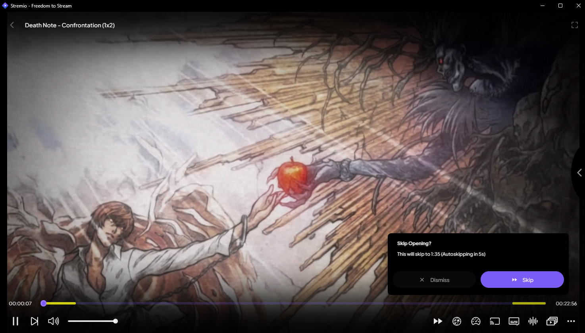
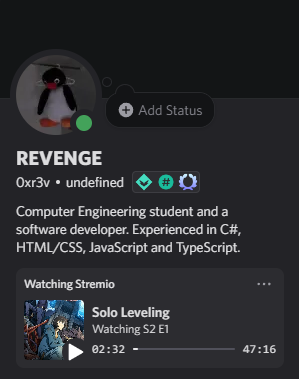

<p align="center">
	<a href="https://stremio.com/">
		
	</a>
	<h1 align="center">Stremio Enhanced</h1>
	<p align="center">
		
		<a href="https://github.com/REVENGE977/stremio-enhanced-community/releases/latest">
			
		</a>
		<br>
		<a href="https://nodejs.org/">
			
		</a>
		<a href="https://www.typescriptlang.org/">
			
		</a>
		<a href="https://www.electronjs.org/">
			
		</a>
		<a href="https://developer.mozilla.org/en-US/docs/Web/HTML">
			
		</a>
		<a href="https://developer.mozilla.org/en-US/docs/Web/CSS">
			
		</a>
	</p>
</p>

## 📌 Table of Contents
- [📌 Table of Contents](#-table-of-contents)
- [❓ What is Stremio Enhanced?](#-what-is-stremio-enhanced)
	- [🛠 How It Works](#-how-it-works)
	- [✨ Features](#-features)
- [📥 Downloads](#-downloads)
- [⚙️ Build From Source](#️-build-from-source)
- [🎨 Themes and Plugins](#-themes-and-plugins)
	- [🖌️ Installing Themes](#️-installing-themes)
	- [🛠️ Installing Plugins](#️-installing-plugins)
- [❓ What Is the Difference Between Plugins and Addons?](#-what-is-the-difference-between-plugins-and-addons)
- [📜 Creating Your Own Plugin](#-creating-your-own-plugin)
- [🎨 Creating Your Own Theme](#-creating-your-own-theme)
- [🐛 Known Issues](#-known-issues)
- [⭐ Support the Project](#-support-the-project)
- [📊 Repository Stats](#-repository-stats)
- [🚨 Important Notice](#-important-notice)

## ❓ What is Stremio Enhanced?

Stremio Enhanced is an Electron-based [Stremio](https://www.stremio.com/) client with support for plugins and themes. It enhances the default Stremio experience by adding more customization options and integrations.  

### 🛠 How It Works  
- It runs the [Stremio Service](https://github.com/Stremio/stremio-service) automatically in the background.
- It loads [the web version of Stremio v5](https://web.stremio.com) within an Electron environment.

### ✨ Features  
- **Themes** – Customize the look and feel of Stremio with different themes to match your style.  
  - Example: **AMOLED Theme** – A pitch black theme.  
      
    *(This theme can be found in [StremioAmoledTheme](https://github.com/REVENGE977/StremioAmoledTheme).)*  

- **Plugins** – Extend Stremio’s functionality with JavaScript plugins for more features.
  - Example: **AniSkip Integration** – A plugin to integrate [AniSkip](https://github.com/aniskip) to autoskip anime openings and endings.
   
   *(This plugin is still work-in-progress and not yet released. Stay tuned for more updates.)*

- **Built-in Toggleable Discord Rich Presence** – Show what you're watching on Discord with an easy-to-toggle Rich Presence feature.  
     


## 📥 Downloads
You can download the latest version from [the releases tab](https://github.com/REVENGE977/stremio-enhanced/releases). If you're on Windows, you can download the stremio service bundled build so you don't have to download and install Stremio Service separately.

## ⚙️ Build From Source
1. Clone the repository: `git clone https://github.com/REVENGE977/stremio-enhanced.git`
2. Navigate to the project directory: `cd stremio-enhanced`
3. Install dependencies: `npm install`
4. Build the project: 
    - For all platforms: `npm run package-all`
    - For Windows: `npm run package-win`
    - For Linux: `npm run package-linux`
    - For macOS x86: `npm run package-macos`
    - For macOS ARM: `npm run package-macos-arm`

## 🎨 Themes and Plugins

### 🖌️ Installing Themes
1. Go to the settings and scroll down.
2. Click on the "OPEN THEMES FOLDER" button.
3. Move your theme into the opened folder.
4. Restart Stremio Enhanced.
5. You should see your theme in the settings with an option to apply it.

### 🛠️ Installing Plugins
1. Go to the settings and scroll down.
2. Click on the "OPEN PLUGINS FOLDER" button.
3. Move your plugin into the opened folder.
4. Restart Stremio Enhanced or reload using <kbd>Ctrl</kbd> + <kbd>R</kbd>
5. You should see your plugin in the settings with an option to enable it.


## ❓ What Is the Difference Between Plugins and Addons?
- **Addons** are available on the normal version of Stremio. They add catalogs and streams for Stremio.
- **Plugins** add more functionality to Stremio, like new features.

## 📜 Creating Your Own Plugin
Plugins are simply JavaScript files running on the client side. Create a JavaScript file with a `.plugin.js` extension and write your code as you would normally for the client side.

As of version v0.3, you are required to provide metadata for the plugin. Here is an example:

```js
/**
 * @name YourPluginNameHere
 * @description What does your plugin do?
 * @updateUrl your plugin's raw file URL for update checking. (Set this to 'none' if you don't want to provide one)
 * @version VersionHere (e.g., 1.0.0)
 * @author AuthorName
 */
```

## 🎨 Creating Your Own Theme
Create a file with a name ending in `.theme.css` and write your CSS modifications there. You can use the devtools (<kbd>Ctrl</kbd>+<kbd>Shift</kbd>+<kbd>I</kbd>) to find an element's class name, etc.

*You are also required to provide metadata in your theme, in the same way as plugins.*

## 🐛 Known Issues
- Subtitles are not available for **some** streams that have embedded subs. This seems to be an issue with either [Stremio Web](https://web.stremio.com/) or Stremio Service, as it also occurs in the browser. Subtitles do work fine for **most** streams though.

## ⭐ Support the Project
Consider giving the project a ⭐ star on GitHub! Your support helps more people discover it and keeps me motivated to improve it.

If you'd like to go the extra mile, you can also support me by sponsoring the project. Every contribution, big or small, is truly appreciated!

[](https://github.com/sponsors/REVENGE977)

## 📊 Repository Stats


## 🚨 Important Notice
**This project is not affiliated in any way with Stremio.**

<p align="center">💻 Developed with ❤️ by <a href="https://github.com/REVENGE977">REVENGE977</a> | 📜 Licensed under MIT</p>
